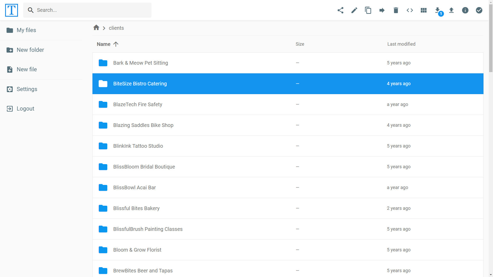

## Dedicated client spaces

Each client has its own login and private space. Create as many client spaces as you need.

---

## Key Features:

### Authenticated Transfers
Feel confident in the authenticity of your file transfers. Our solution ensures that every interaction is authenticated, providing a secure and reliable channel for sharing sensitive data with your clients.

### Encrypted Communication
Security is at the forefront of our priorities. Experience file sharing with enterprise-grade encryption, ensuring the confidentiality and integrity of your data throughout the entire transfer process.

### Reliable Performance
Your business demands dependability. Count on us for consistent and reliable file transfers. Our SaaS solution is engineered to deliver your files promptly, contributing to a smoother workflow and enhanced client interactions.

### Easy-to-Use Interface
Simplify your file sharing processes. Our user-friendly interface is designed with your convenience in mind, making collaboration with clients effortless and enjoyable.

### Additional Features:

- **Organized Folders:** Effortlessly manage your files with an organized folder structure.
- **Centralized Management:** Streamline control with centralized file management.
- **Scalability:** Grow your business without limitations with our scalable solution.
- **Unlimited Users and Admins:** Collaborate with an unlimited number of users and administrators.
- **Professional Branding:** Showcase your professionalism with branded file sharing.
- **Access from Any Device:** Stay connected and share files seamlessly from any device.
- **Automation Capabilities:** Save time with automated file transfer processes.
- **API and Integration Support:** Integrate seamlessly with other tools and systems.
- **Large File Support:** Transfer large files effortlessly without compromising speed.
- **High-Speed Transfers:** Experience swift and efficient file transfers.
- **Web-Based Convenience:** Access and manage your files conveniently through our web-based platform.
- **Affordable Pricing:** Enhance client collaborations without breaking the bank, starting at just $19 per month.

## Get Started Today!

Join the ranks of businesses that prioritize secure and professional file sharing with their clients. Elevate your collaboration game, streamline your workflow, and strengthen your client relationships.

[Sign Up Now](#start-your-demo-trial) for a demo trial and experience the future of secure file sharing! Trust our SaaS solution to be your reliable partner in client collaboration.


